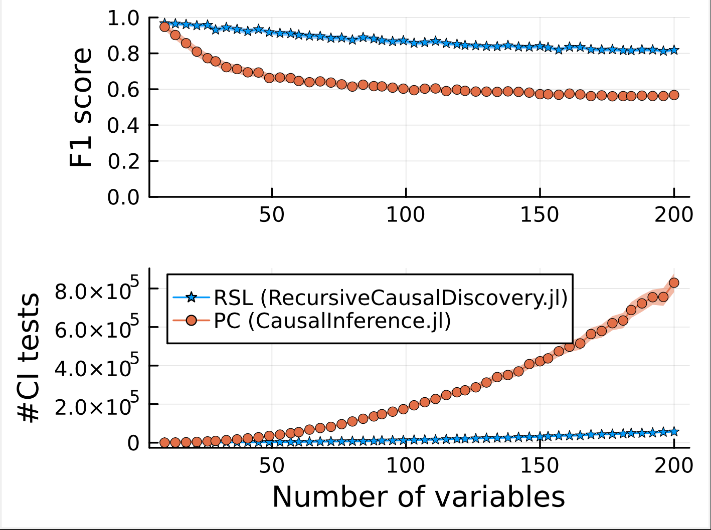

# RecursiveCausalDiscovery.jl
A Julia implementation of [Recursive Causal Discovery](https://arxiv.org/abs/2403.09300) algorithms. Recursive Causal Discovery (RCD) is an efficient approach for causal discovery (i.e., learning a causal graph from data).

#### ⚠️ This package is still under development! ⚠️
[](https://github.com/sepehr78/RecursiveCausalDiscovery.jl/actions/workflows/ci.yml)
[](https://codecov.io/github/sepehr78/RecursiveCausalDiscovery.jl)

# Overview
### Comparison of RCD with the PC algorithm implemented in [CausalInference.jl](https://github.com/mschauer/CausalInference.jl)
The following plots show the F1 score (computed using true causal graph), and number of conditional independency (CI) tests done.


### Implemented algorithms
 - [x] Recursive Structure Learning (RSL)
 - [ ] MArkov boundary-based Recursive Variable ELimination (MARVEL)
 - [ ] Latent MARVEL (L-MARVEL)
 - [ ] Removable Order Learning (ROL)

# Installation
Requires at least Julia 1.10
```julia
julia> ]add RecursiveCausalDiscovery
```

# Simple use
```julia
using RecursiveCausalDiscovery
using CSV
using Tables

# load data (columns are variables and rows are samples)
data = CSV.read("data.csv", Tables.matrix)

# use a Gaussian conditional independence test
sig_level =  0.01
ci_test = (x, y, cond_vec, data) ->  fisher_z(x, y, cond_vec, data, sig_level)

# learn the skeleton of causal graph using RSL
learned_skeleton =  learn_and_get_skeleton(data, ci_test)
```

# Citation
If you do use this package, please cite our [work](https://arxiv.org/abs/2403.09300).

```bibtex
@misc{mokhtarian2024rcd,
      title={Recursive Causal Discovery}, 
      author={Ehsan Mokhtarian and Sepehr Elahi and Sina Akbari and Negar Kiyavash},
      year={2024},
      eprint={2403.09300},
      archivePrefix={arXiv},
      primaryClass={cs.LG},
      url={https://arxiv.org/abs/2403.09300}, 
}
```